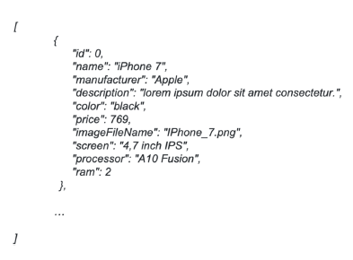

## SOAMEE STUDIO

### Phone Catalog
#### MINIMUM REQUIREMENTS
In broad terms the idea is to have as an outcome at least the following: 
1. A REST API providing phones’ information.
- It can be implemented in whatever framework you are most comfortable with (preferred a NodeJS one).
- It should have at least one endpoint:  
Method: GET 
Path : /phones 
Response body example:  

2. A REACT APP allowing the user to browse the phones catalog.
- The look and feel should not be super sophisticated but it should be decent and somehow responsive so that it doesn’t look terrible on a mobile phone.
- The home page should display the list of phones. Make sure to displayimages of them.
- It should be possible to select a given phone and obtain the phone detailsview displaying a few more info about that phone.
- The phones’ information should be retrieved from the above described API.
- There should be a spinner or placeholder component while the REST APIrequest is ongoing and the app is waiting for phones data.
3. GitHub public repository holding the code of the above points.
- It should have a README.md describing the product and explaining howto run
both the REST API and the REACT APP.

### NICE TO HAVE
The above section bullets are the basic things that we would like you to take care of but We are
not setting any limits regarding the functionalities and complexity of the final solution that you are
going to implement, this is something that we will leave up to you. For this reason here are a
couple of hints and ideas:

1. Libraries and third party code. You can use as many libraries as you want both in the REACT APP and in the REST API.
2. CRUD capabilities. You can implement a full CRUD compliant list of endpoints on the REST API and use them in the REACT APP to implement things like:
-  Phone edition
-  Phone deletion
- Phone creation
3. Testing. You can go for:
-  Unit / Integration / End2End / all of them.
- Mocha / Jest / Cypress / Any other interesting testing framework.
4. Persistence layer. You can go for any of the following approaches
- Simple .json / .txt / ... file.
- Relational / Non-Relational DB.
- Any other interesting approach
5. Shipping. You can go for:
- Dockerizing both REACT APP and REST API and even orchestrating them with Docker-Compose.
- Deploy them somewhere (heroku / your kubernetes cluster / any other interesting place)